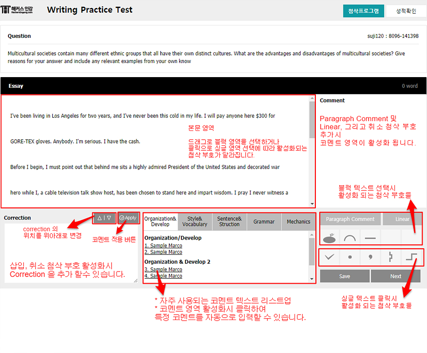

# 해커스 인강 첨삭 프로젝트 #

### 1. Description ###  
해커스 인강 첨삭 프로젝트입니다.  
학생이 영어로 작성한 에세이에 대해 강사가 첨삭을 추가해 리뷰를 제공합니다.   
서버 연동 작업 전 프론트 개발만 추가되어 있으므로  
백엔드 개발이 추가적으로 필요한 몇몇 특정 기능은 동작하지 않습니다.  
    <br />
예) 성적 확인 버튼, 전체 단어수 표시, 저장 및 Next 버튼


### 2. 서비스 대상 및 호환 ###  
* 대상 : 해커스 강사
* 목적 : 학생들이 작성한 영문 에세이에 대한 첨삭 서비스 제공.
* 대상 브라우저 : chrome, firefox, ie 9 이상 - 강사 사용 환경인 맥용 크롬에 최적화 되었습니다(Chrome for Mac os)
    
### 3. Demo ###  
* [기본 화면](http://losbanos.github.io/)  
* [첨삭 중간 저장 후](https://losbanos.github.io/index_reload.html)
  
### 4. Features, Usage ###  
1. 첨삭이 필요한 본문 텍스트 드래그 및 클릭 후 첨삭 부호 선택
2. 텍스트 선택 영역에 따라 각각 다른 첨삭 부호의 활성화
3. 특정 첨삭 부호 (취소,문단, 삽입)등에는 comment 및 correction 의 추가 가능  
4. 자주 사용하는 코멘트에 대한 리스팅 및 선택 사용
5. 마우스 오른 버튼으로 첨삭 부호 삭제
  
  

### 5. 개발 및 테스트 환경 ###  
* Build by [Webpack](https://webpack.js.org/) 2.4 ~ 2.8
* Unit Test by [Karma](https://karma-runner.github.io/1.0/index.html), [Chai](http://chaijs.com/)
* JS Lib: 운영 및 차후 인수 인계를 위해 jQuery 사용
* 그외 mustache 등 템플릿 라이브러리 사용( [package.json](https://github.com/losbanos/caret/blob/master/package.json) 참조 )  
   

### 6. How do I get set up? ###
* [node 다운로드](https://nodejs.org/ko/)  
```shell
$ npm init
```
* install dependencies
```shell
$ npm install
```  
* 개발 스크립트
```shell
$ npm run dev
or
$ webpack-dev-server --inline -d --config webpack.config.dev.js --colors
```
* 배포용
```shell
$ npm run build
or
$ webpack --config webpack.config.build.js --colors 
```
[package.json](https://github.com/losbanos/caret/blob/master/package.json) 참조

### 7. 폴더 구조 ###  
* dist : 배포용 파일  
* src : 실 작업 파일 및 템플릿, 테스트 코드 파일